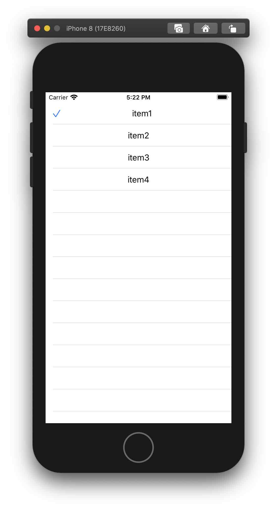

# SelectableList

SwiftUIのリストだと選択されていることがわかりにくいと思ったので、作りました。




コード例：
```
struct ContentView: View {
    let data = ["item1", "item2", "item3", "item4"]
    @State private var selected:String?
    var body: some View {
        VStack{
            SelectableList(content: data, selectedItem: $selected, rowCell: { item -> Text in
                    Text(item)
                }
                , selectionAction: { item in
                    print("\(item) selected")
            })
        }
    }
}

struct ContentView_Previews: PreviewProvider {
    static var previews: some View {
        ContentView()
    }
}
```

課題
- rowCellがText限定なのをなんとかしたい
- ImageがiOSにしかないので、iOS限定だけど、そのうちMacOSにも対応させたい。（SwiftPackageがリソース対応してくれるのを待ってます）
